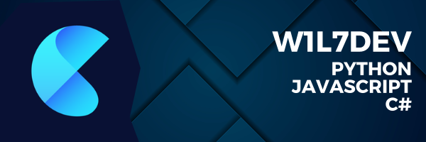

# Hi there 👋

  
 

---

## `💻 About me`

- 🎓 I'm a Canadian Student 🍁
- 🌱 I’m currently learning Rust 🦀 and C# 🌐
- 🎹 I enjoy playing music 🎵
- 📂 I started programming `3 years ago`

## `🔧 Languages and Tools`

## `📚 Projects`

## `📊 Stats`

## `📫 Contact`

- 📧 Email: [w1l7dev@gmail.com](mailto:w1l7dev@gmail.com)
- 🎮 Discord: W1L7#9944
- 🐦 Twitter: [@W1L7dev](https://twitter.com/W1L7dev)

## `📏 Metrics`

![Metrics](https://metrics.lecoq.io/W1L7dev?template=classic&base.community=0&base.repositories=0&base.metadata=0&languages=1&lines=1&achievements=1&code=1&base=header%2C%20activity%2C%20community%2C%20repositories%2C%20metadata&base.indepth=false&base.hireable=false&base.skip=false&languages=false&languages.skipped=Navigation%2C%20W1L7dev&languages.limit=8&languages.threshold=0%25&languages.other=false&languages.colors=github&languages.sections=most-used&languages.indepth=false&languages.analysis.timeout=15&languages.analysis.timeout.repositories=7.5&languages.categories=markup%2C%20programming&languages.recent.categories=markup%2C%20programming&languages.recent.load=300&languages.recent.days=14&lines=false&lines.skipped=Navigation%2C%20W1L7dev&lines.sections=base&lines.repositories.limit=4&lines.history.limit=1&achievements=false&achievements.threshold=C&achievements.secrets=true&achievements.display=detailed&achievements.limit=0&code=false&code.lines=12&code.load=400&code.days=3&code.visibility=public&code.skipped=Navigation%2C%20W1L7dev&code.languages=Python%2C%20Javascript&config.timezone=America%2FToronto)
