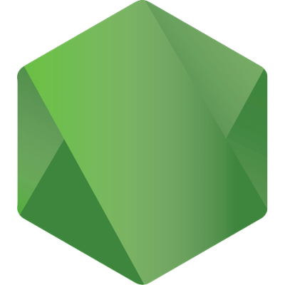

# Hey, I'm W1L7dev
### Python, Web and Unity Developer

Sup everyone, I'm W1L7dev, a 14 year old developer from Canada 🍁. I'm currently working on a few projects, including a Discord bot, my own website and a game. I'm also learning C# and Rust.

## Languages and Tools

  
  
  
  
  
  

---

